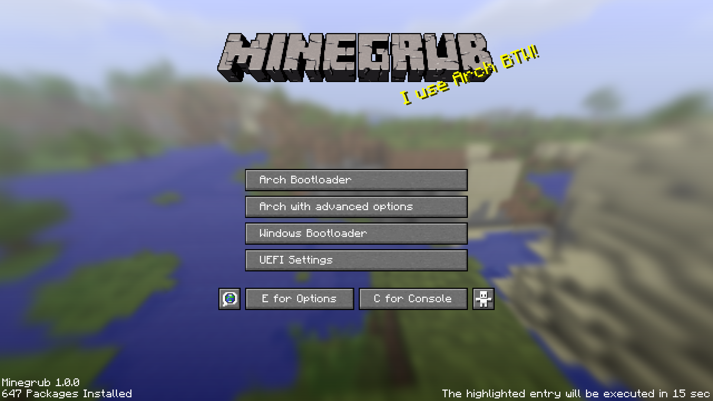

# Minegrub
A Grub Theme in the style of Minecraft!




## Installation
> ### Note: grub vs grub2
> - If you have a `/boot/grub2` folder instead of a `/boot/grub` folder , you need to adjust the file paths mentioned here and in the `minegrub-update.service` file
> - Also if you're not sure, run `grub-mkconfig -V` to check if you have grub version 2 (you should have)

### Manually

- Clone this repository
```
git clone https://github.com/Lxtharia/minegrub-theme.git
```
- (optional) Choose a background 
```
./choose-background.sh  # or just copy a custom image to minegrub/background.png
```
- Copy the folder to your boot partition: (for info: `-ruv` = recursive, update, verbose)
```
cd ./minegrub-theme
sudo cp -ruv ./minegrub /boot/grub/themes/
```
- Change/add this line in your `/etc/default/grub`:
```
GRUB_THEME=/boot/grub/themes/minegrub/theme.txt
```
- Update your live grub config by running
```
sudo grub-mkconfig -o /boot/grub/grub.cfg
```
- You're good to go!

### NixOS module (flake)

<details><summary>This is a minimal example</summary>

```nix
# flake.nix
{
  inputs.minegrub-theme.url = "github:Lxtharia/minegrub-theme";
  # ...

  outputs = {nixpkgs, ...} @ inputs: {
    nixosConfigurations.HOSTNAME = nixpkgs.lib.nixosSystem {
      modules = [
        ./configuration.nix
        inputs.minegrub.nixosModules.default
      ];
    };
  }
}

# configuration.nix
{ pkgs, ... }: {

  boot.loader.grub = {
    minegrub-theme = {
      enable = true;
      splash = "100% Flakes!";
    };
    # ...
  };
}
```
</details>


## Random splash texts and accurate "x Packages Installed" text!
The `update_theme.py` script chooses a random line from `resources/splashes.txt` and generates and replaces the `logo.png` which holds the splash text, as well as updates the amount of packages currently installed
- Make sure `neofetch` is installed
- Make sure Python 3 (or an equivalent) and the Pillow python package are installed
  - Install Pillow either with the python-pillow package from the AUR or with
    `sudo -H pip3 install pillow`
  - It's important to use `sudo -H`, because it needs to be available for the root user
- To add new splash texts simply edit `./resources/splashes.txt` and add them to the end of the file (if you add it at the beginning or in the middle, some splashes may never get used because the image cashing uses the line of the file the splash is on)
- If you want to remove splashes you should reset the cache by deleting `/boot/grub/themes/minegrub/cache`
- If you want to get a specific splash for the next boot, run `python update_theme.py "Splashing!"`

### Update splash and "Packages Installed"...
#### ...manually
- Just run `python /boot/grub/themes/minegrub/update_theme.py` (from anywhere) after boot using whatever method works for you

#### ...with init-d (SysVinit)
- Just copy the `./minegrub-SysVinit.sh` under `/etc/init.d` as `minecraft-grub` then run `update-rc.d minecraft-grub defaults` as root privileges:
```bash
sudo cp -v "./minegrub-SysVinit.sh" "/etc/init.d/minecraft-grub"
sudo chmod u+x "/etc/init.d/minecraft-grub" # Just to be sure the permissions are set correctly.
sudo update-rc.d minecraft-grub defaults
```

#### ...with systemd
- Edit `./minegrub-update.service` to use `/boot/grub2/` on line 5 if applicable
- Copy `./minegrub-update.service` to `/etc/systemd/system`
- Enable the service: `systemctl enable minegrub-update.service`
- If it's not updating after rebooting (it won't update on the first reboot because it updates after you boot into your system), check `systemctl status minegrub-update.service` for any errors (for example if pillow isn't installed in the correct scope)

## Adjusting for a different amount of boot options:
- When you have more/less than 4 boot options, you might want to adjust the height of the bottom bar (that says "Options" and "Console")
- The formula and some precalculated values (for 2,3,4,5... boot options) are in the `theme.txt`, so you should be able to easily change it to the correct value.

## Notes:
- the `GRUB_TIMEOUT_STYLE` in the defaults/grub file should be set to `menu`, so it immediately shows the menu (else you would need to press ESC and you dont want that)
- I'm no Linux expert, that's why I explain it so thoroughly, for other newbies :>
- i use arch btw
- i hope u like it, cause i sure do lmao

### Thanks to
- https://github.com/toboot for giving me this wonderful idea!
- the internet for giving me wisdom lmao (Mainly http://wiki.rosalab.ru/en/index.php/Grub2_theme_tutorial)
- The contributors for contributing and giving me some motivation to improve some little things here and there


Font downloaded from https://www.fontspace.com/minecraft-font-f28180 and used for non commercial use.
