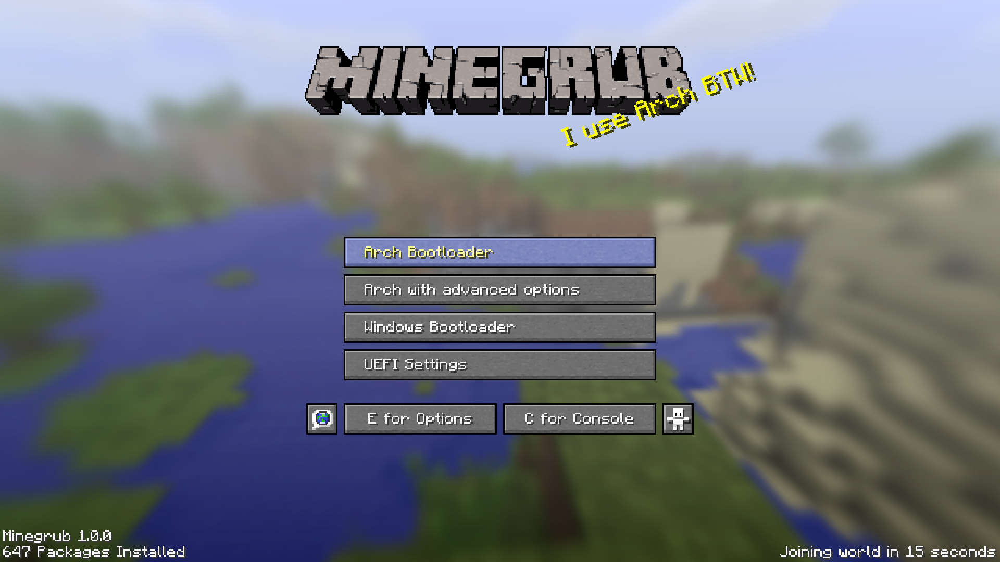

**The Minecraft Grub Theme Trio:**

| *> Minecraft Main Menu <* | [Minecraft World Selection Menu](https://github.com/Lxtharia/minegrub-world-sel-theme) | [Using both themes together](https://github.com/Lxtharia/double-minegrub-menu) |
| --- | --- | --- |

**Also check out these other projects:**
| [Minecraft SDDM Theme](https://github.com/Davi-S/sddm-theme-minesddm) by Davi-S | [Minecraft Plymouth Theme](https://github.com/nikp123/minecraft-plymouth-theme) by nikp123 | [Minecraft World Loading KDE Splash](https://github.com/Samsu-F/minecraftworldloading-kde-splash) by Samsu-F
| --- | --- | --- |


There is also a [Spanish translation](https://github.com/FeRChImoNdE/minegrub-theme-es)!

# Minegrub

A Grub Theme in the style of Minecraft!




# Installation

## Using the installation script
Run the interactive installation script as root and at your own risk (It's run as sudo after all)
```
sudo ./install_theme.sh
```
- This will help you install the theme, the systemd service and enable the console background (see below)
- It also lets you choose a background if you don't want to randomize it

## Manually

> ### Note: grub vs grub2
> - If you have a `/boot/grub2` folder instead of a `/boot/grub` folder , you need to adjust the file paths mentioned here and in the `minegrub-update.service` file
> - Also if you're not sure, run `grub-mkconfig -V` to check if you have grub version 2 (you should have)

- Clone this repository
```
git clone https://github.com/Lxtharia/minegrub-theme.git
cd ./minegrub-theme
```
- (optional) Choose a background
```
./choose_background.sh  # or just copy a custom image to minegrub/background.png
```
  - If you want to use the update script, copy an arbitrary number of images you would like to use to `minegrub/backgrounds/`. You can find some options in `background_options/` but you can also use your own images.
  - If you do not want to use the update script or if you always want to use the same background, you can use `./choose_background.sh` or just copy a custom image to `minegrub/background.png`

- Copy the folder to your boot partition: (for your interest: `-ruv` = recursive, update, verbose)
```
sudo cp -ruv ./minegrub /boot/grub/themes/
```
- Open `/etc/default/grub` with your text editor and change/uncomment this line:
```
GRUB_THEME=/boot/grub/themes/minegrub/theme.txt
```
- Update your live grub config by running
    ```
    sudo grub-mkconfig -o /boot/grub/grub.cfg
    ```
- You're good to go!
- Check out the `Configuration` section if you want to auto-update the splash text, the background and the packages display after every boot

---

## NixOS module (flake)

<details><summary>This is a minimal example</summary>

```nix
# flake.nix
{
  inputs.minegrub-theme.url = "github:Lxtharia/minegrub-theme";
  # ...

  outputs = {nixpkgs, ...} @ inputs: {
    nixosConfigurations.HOSTNAME = nixpkgs.lib.nixosSystem {
      modules = [
        ./configuration.nix
        inputs.minegrub-theme.nixosModules.default
      ];
    };
  }
}

# configuration.nix
{ pkgs, ... }: {

  boot.loader.grub = {
    minegrub-theme = {
      enable = true;
      splash = "100% Flakes!";
      background = "background_options/1.8  - [Classic Minecraft].png";
      boot-options-count = 4;
    };
    # ...
  };
}
```
</details>

# Common Issues

## Theme doesn't show

Make sure to check the following lines are set in `/etc/defaults/grub`:
- Set `GRUB_TIMEOUT_STYLE=menu`, so it immediately shows the menu (or else you would need to press ESC first)
- **Comment out** `GRUB_TERMINAL_OUTPUT="console"` (by placing a `#` in front) because this would disable the graphical terminal.
  - You could also add `GRUB_TERMINAL_OUTPUT="gfxterm"` to overwrite a possible default value.

## The font is too small
Secure boot prevents grub from loading the fonts correctly, so the only solution for this I know is to disable secure boot in your BIOS. 

## The theme is stretched / buttons are too small / too big
Make sure to set the right resolution for your screen in `/etc/default/grub` like `GRUB_GFXMODE=2560x1440,1920x1080,auto`. You can see which resolutions your PC supports while pressing `c` while in the real grub menu and running the `videoinfo` command.

# Configuration

## Adjusting for a different amount of boot options:

- If you have more or less than 4 boot options, the buttons will overlap with the bottom bar (the one saying "Options" and "Console")
- To move that bar down and fix this, all you need to do is edit [this line](https://github.com/Lxtharia/minegrub-theme/blob/main/minegrub/theme.txt#L71) in the theme.txt: `/boot/grub/themes/minegrub/theme.txt`
  - (You can also edit the file in the cloned repository so you don't overwrite it again when you update the theme at some point (via a `cp -r`))
- The formula and some precalculated values (for 2,3,4,5... boot options) are in the `theme.txt`, so you should be able to easily change it to the correct value.

## Changing splash text, background and the "x Packages Installed" text!

The `update_theme.py` script can make the theme more dynamic: It...
- Chooses a random line from `assets/splashes.txt` (and then generates and replaces the `logo.png` which holds the splash text)
  - To add new splash texts simply edit `./minegrub/assets/splashes.txt` and add them to the file.
- Update the amount of packages currently installed.
- Randomly chooses a file from `backgrounds/` (ignoring hidden files beginning with a dot) as the background image.
  - Put all backgrounds you want to randomly choose from in `./minegrub/backgrounds/`. Hidden files (i.e. filenames beginning with a dot) will be ignored. You can also add your own images.
- If you want to get a specific splash and/or background for the next boot, run `python update_theme.py [BACKGROUND_FILE [SPLASH]]` (e.g. `python update_theme.py 'backgrounds/1.15 - [Buzzy Bees].png' 'Splashing!'`)
  - Empty string parameters will be replaced by a random choice, e.g. `python update_theme.py '' 'Splashing!'` for a random background and the splash `Splashing!`.

**Dependencies**:
- Make sure `fastfetch` or `neofetch` is installed
- Make sure Python 3 (or an equivalent) and the Pillow python package are installed
  - Install Pillow either with the python-pillow package from the AUR or with
    `sudo -H pip3 install pillow`
  - It's important to use `sudo -H`, because it needs to be available for the root user

### Automatically update splash and "Packages Installed"...

#### ...directly

- Just run `python /boot/grub/themes/minegrub/update_theme.py` (from anywhere) after boot using whatever method works for you

#### ...with init-d (SysVinit)

- Just copy the `./minegrub-SysVinit.sh` under `/etc/init.d` as `minecraft-grub` then run `update-rc.d minecraft-grub defaults` as root privileges:
```bash
sudo cp -v "./minegrub-SysVinit.sh" "/etc/init.d/minecraft-grub"
sudo chmod u+x "/etc/init.d/minecraft-grub" # Just to be sure the permissions are set correctly.
sudo update-rc.d minecraft-grub defaults
```

#### ...with systemd

- Edit `./minegrub-update.service` to use `/boot/grub2/` on line 5 if applicable
- Copy `./minegrub-update.service` to `/etc/systemd/system`
- Enable the service: `systemctl enable minegrub-update.service`
- If it's not updating after rebooting (it won't update on the first reboot because it updates after you boot into your system), check `systemctl status minegrub-update.service` for any errors (for example if pillow isn't installed in the correct scope)

## Setting the console background

When in grub, pressing 'c' opens the grub console.
A background you can be specified with `GRUB_BACKGROUND=<path>` in `/etc/defaults/grub`**though this doesn't work if a theme is set**

For this, you need to patch a line in a specific grub file. The installation script will do this for you, or you can use this pretty looking sed command:
```bash
# Create a backup of the file first
cp /etc/grub.d/00_header ./00_header.bak
# replace the elif in that line with an fi; if
sed --in-place -E 's/(.*)elif(.*"x\$GRUB_BACKGROUND" != x ] && [ -f "\$GRUB_BACKGROUND" ].*)/\1fi; if\2/' /etc/grub.d/00_header
```
Now you can set 
```
GRUB_BACKGROUND="/boot/grub/themes/minegrub/dirt.png"
```
And don't forget to regenerate the `grub.cfg` :)


# Notes:

- i use arch btw
- please don't sue me mojang, i've made zero dollars on this
- if you work at mojang and _use_ this theme there, send me some proof lmao, that would be much more worth than dollars

---

### Thanks to

- https://github.com/toboot for giving me this wonderful idea!
- the internet for giving me wisdom lmao (Mainly http://wiki.rosalab.ru/en/index.php/Grub2_theme_tutorial)
- The contributors for contributing and giving me some motivation to improve some little things here and there
- [Vanilla Tweaks](https://vanillatweaks.net) for some of the backgrounds


Font downloaded from https://www.fontspace.com/minecraft-font-f28180 and used for non-commercial use.
